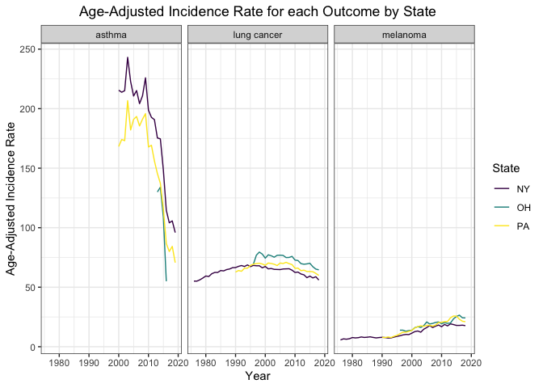

merge\_outcomes
================

``` r
library(tidyverse)
library(tidyr)
library(dplyr)
```

## Combining state-level outcome data

First, let’s combine lung and skin cancer data at the state level.

``` r
# read in state data for lung and skin cancer

#state level lung cancer data
state_lc_data = read_csv("./data/lung/state_lc_data.csv")
```

    ## Rows: 95 Columns: 4

    ## ── Column specification ────────────────────────────────────────────────────────
    ## Delimiter: ","
    ## chr (2): state, outcome
    ## dbl (2): year, age_adjusted_incidence_rate

    ## 
    ## ℹ Use `spec()` to retrieve the full column specification for this data.
    ## ℹ Specify the column types or set `show_col_types = FALSE` to quiet this message.

``` r
#state level melanoma data
state_mel_data = read_csv("./data/incidence_melanoma_data/state_melanoma_age_adjusted.csv") %>%
  rename(c("outcome" = "cancer_type"))
```

    ## Rows: 95 Columns: 4

    ## ── Column specification ────────────────────────────────────────────────────────
    ## Delimiter: ","
    ## chr (2): state, cancer_type
    ## dbl (2): year, age_adjusted_incidence_rate

    ## 
    ## ℹ Use `spec()` to retrieve the full column specification for this data.
    ## ℹ Specify the column types or set `show_col_types = FALSE` to quiet this message.

``` r
# combine cancer outcome data
lc_mel_state = bind_rows(state_lc_data, state_mel_data) %>%
  select(state, year, outcome, age_adjusted_incidence_rate)
```

Next, let’s combine asthma data with the cancer data at the state level.
First, let’s read in the asthma state-level data.

``` r
asthma_state <- read_csv(here::here("data", "asthma_state.csv")) %>%
  rename(age_adjusted_incidence_rate = rate) %>%
  select(state, year, outcome, age_adjusted_incidence_rate)
```

    ## Rows: 44 Columns: 4

    ## ── Column specification ────────────────────────────────────────────────────────
    ## Delimiter: ","
    ## chr (2): state, outcome
    ## dbl (2): year, rate

    ## 
    ## ℹ Use `spec()` to retrieve the full column specification for this data.
    ## ℹ Specify the column types or set `show_col_types = FALSE` to quiet this message.

Next, let’s combine the asthma and cancer state-level data.

``` r
# Bind rows of cancer and asthma by state and arrange accordingly
lc_mel_asthma_state <- bind_rows(lc_mel_state, asthma_state) %>%
  arrange(state, year, outcome)
```

Let’s plot the combined data with year on the x-axis, age-adjusted
incidence rate on the y-axis, stratified by state (color) and outcome
(facet).

``` r
lc_mel_asthma_state %>%
  ggplot(aes(x = year, y = age_adjusted_incidence_rate,
             color = state)) +
  geom_line() +
  facet_wrap(~outcome) +
  theme_bw() +
  labs(
    title = "Age-Adjusted Incidence Rate for each Outcome by State",
    x = "Year",
    y = "Age-Adjusted Incidence Rate",
    color = "State"
  ) +
  theme(plot.title = element_text(hjust = 0.5))
```

<!-- -->

Lastly, let’s write out the combined data.

``` r
write_csv(lc_mel_asthma_state, here::here("data", "lc_mel_asthma_state.csv"))
```

## Combining county-level outcome data

First, let’s combine lung and skin cancer data at the county level.

``` r
# read in county data for lung and skin cancer

county_lc = read_csv("./data/lung/county_lc.csv")
```

    ## Rows: 217 Columns: 4

    ## ── Column specification ────────────────────────────────────────────────────────
    ## Delimiter: ","
    ## chr (3): state, county, outcome
    ## dbl (1): age_adjusted_incidence_rate

    ## 
    ## ℹ Use `spec()` to retrieve the full column specification for this data.
    ## ℹ Specify the column types or set `show_col_types = FALSE` to quiet this message.

``` r
county_mel = read_csv("./data/incidence_melanoma_data/state_county_melanoma_incidence_2014_2018.csv")
```

    ## Rows: 280 Columns: 4

    ## ── Column specification ────────────────────────────────────────────────────────
    ## Delimiter: ","
    ## chr (3): state, county, cancer_type
    ## dbl (1): age_adjusted_incidence_rate

    ## 
    ## ℹ Use `spec()` to retrieve the full column specification for this data.
    ## ℹ Specify the column types or set `show_col_types = FALSE` to quiet this message.

``` r
fips_codes = read_csv("./data/fips_codes.csv")
```

    ## Rows: 3232 Columns: 3

    ## ── Column specification ────────────────────────────────────────────────────────
    ## Delimiter: ","
    ## chr (2): Name, State
    ## dbl (1): FIPS

    ## 
    ## ℹ Use `spec()` to retrieve the full column specification for this data.
    ## ℹ Specify the column types or set `show_col_types = FALSE` to quiet this message.

``` r
# cleaning to make the data sets compatible

county_mel = county_mel %>%
  rename(c("outcome" = "cancer_type")) %>%
  drop_na() 

county_mel <- county_mel[!(county_mel$county == "Ohio" | county_mel$county == "Pennsylvania" | 
     county_mel$county == "New York"), ] %>%
  filter(!grepl('SEER', county))

county_mel$county <- gsub(" County","", county_mel$county)

county_mel$county[county_mel$county == "St Lawrence"] <- "St. Lawrence"

county_lc$county <- gsub(" County","", county_lc$county)

# binding rows

lc_mel_county = bind_rows(county_lc, county_mel) %>%
  filter(complete.cases(.)) 


fips = fips_codes %>%
    janitor::clean_names() %>%
    rename(c("county" = "name"))

lc_mel_county = merge(lc_mel_county, fips, by = c("state", "county"))
```

Next, we will read in asthma data and combine it with the cancer data.

First, let’s read in the asthma county data, rename column names and add
an additional column for county fips code.

``` r
# Read in asthma data
# Only get county data for the year 2016 since we need county data at
# a fixed time point (i.e. not longitudinal)
# Adjust column names and types in prep for merge
asthma_county <- read_csv(here::here("data", "asthma_county.csv")) %>%
  filter(year == 2016) %>%
  select(-year) %>%
  rename(age_adjusted_incidence_rate = rate) %>%
  mutate(age_adjusted_incidence_rate = as.double(age_adjusted_incidence_rate))
```

    ## Rows: 2482 Columns: 5

    ## ── Column specification ────────────────────────────────────────────────────────
    ## Delimiter: ","
    ## chr (4): state, county, outcome, rate
    ## dbl (1): year

    ## 
    ## ℹ Use `spec()` to retrieve the full column specification for this data.
    ## ℹ Specify the column types or set `show_col_types = FALSE` to quiet this message.

    ## Warning in mask$eval_all_mutate(quo): NAs introduced by coercion

``` r
asthma_county <- merge(asthma_county, fips, by = c("state", "county"))
```

Next, let’s combine the asthma and cancer county data.

``` r
# Bind rows of cancer and asthma by county and arrange accordingly
lc_mel_asthma_county <- bind_rows(lc_mel_county, asthma_county) %>%
  arrange(state, county, outcome)
```

Lastly, let’s write out the combined data.

``` r
write_csv(lc_mel_asthma_county, here::here("data", "lc_mel_asthma_county.csv"))
```
