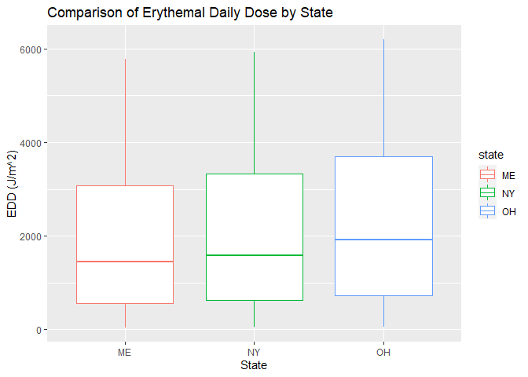
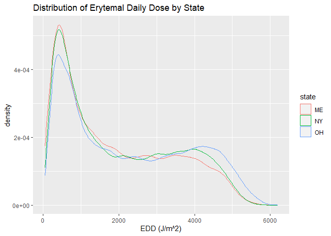
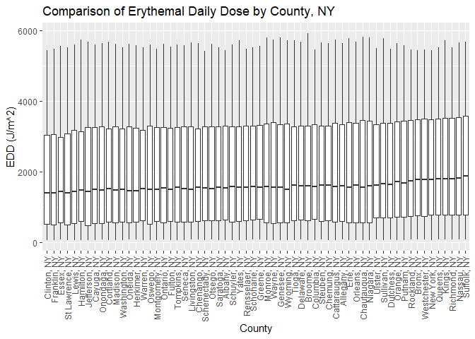
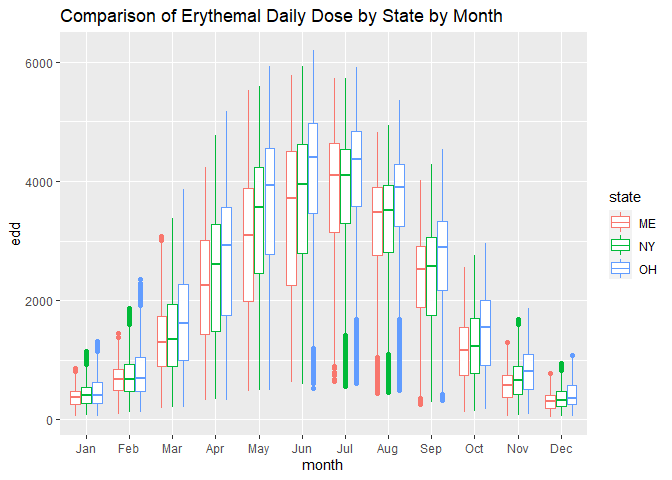
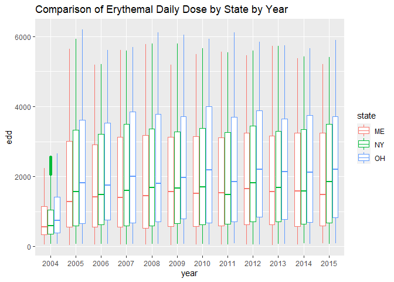

UV radiation data
================
Jesse R. Ames
11/29/2021

## Data

Source:
<https://data.cdc.gov/Environmental-Health-Toxicology/Population-Weighted-Ultraviolet-Irradiance-2004-20/h28b-t43q/data#About>

Before downloading, I filtered to our states of interest (Maine, New
York, Ohio, and Pennsylvania) using the CDC’s web application. The state
FIPS codes for Maine, New York, Ohio, and Pennsylvania are 23, 36, 39,
and 42, respectively, per the U.S. Department of Agriculture.

``` r
library(tidyverse)
```

    ## -- Attaching packages --------------------------------------- tidyverse 1.3.1 --

    ## v ggplot2 3.3.5     v purrr   0.3.4
    ## v tibble  3.1.4     v dplyr   1.0.7
    ## v tidyr   1.1.3     v stringr 1.4.0
    ## v readr   2.0.1     v forcats 0.5.1

    ## -- Conflicts ------------------------------------------ tidyverse_conflicts() --
    ## x dplyr::filter() masks stats::filter()
    ## x dplyr::lag()    masks stats::lag()

``` r
uv <- read_csv("data/Population-Weighted_Ultraviolet_Irradiance__2004-2015.csv")
```

    ## Rows: 657526 Columns: 11

    ## -- Column specification --------------------------------------------------------
    ## Delimiter: ","
    ## dbl (11): statefips, countyfips, year, month, day, edd, edr, i305, i310, i32...

    ## 
    ## i Use `spec()` to retrieve the full column specification for this data.
    ## i Specify the column types or set `show_col_types = FALSE` to quiet this message.

``` r
names(uv)
```

    ##  [1] "statefips"  "countyfips" "year"       "month"      "day"       
    ##  [6] "edd"        "edr"        "i305"       "i310"       "i324"      
    ## [11] "i380"

According to the metadata provided with this dataset
(OMIUV\_Metadata\_May2017.pdf), we have the following variables:

-   `statefips` - FIPS code of the state of the observations
-   `countyfips` - FIPS code of the county of the observations
-   `year`, `month`, and `day` (from 2004 to 2015)
-   `edd` - “Daily county-level population weighted erythemally weighted
    daily dose, with the unit of J/m^2”
-   `edr` - “Daily county-level population weighted erythemally weighted
    irradiance at local solar noon time, with the unit of mW/m^2”
-   `i305` - “Daily county-level population weighted spectral irradiance
    at local solar noon time at 305 nm, with the unit of mW/m^2/nm”
-   `i310` - “Daily county-level population weighted spectral irradiance
    at local solar noon time at 310 nm, with the unit of mW/m^2/nm”
-   `i324` - “Daily county-level population weighted spectral irradiance
    at local solar noon time at 324 nm, with the unit of mW/m^2/nm”
-   `i380` - “Daily county-level population weighted spectral irradiance
    at local solar noon time at 380 nm, with the unit of mW/m^2/nm”

The metadata additionally specifies how missing data was coded:

“NAs in the dataset appear as missing values; these refer to no valid
data and are caused by invalid retrievals from OMI. We suggest to treat
NAs as missing.”

Now, we need the county-level FIPS codes. How do we get those? Web
scraping the [USDA
website](https://www.nrcs.usda.gov/wps/portal/nrcs/detail/national/home/?cid=nrcs143_013697):

``` r
library(rvest)
```

    ## 
    ## Attaching package: 'rvest'

    ## The following object is masked from 'package:readr':
    ## 
    ##     guess_encoding

``` r
library(httr)

usda_countyfips <- read_html("https://www.nrcs.usda.gov/wps/portal/nrcs/detail/national/home/?cid=nrcs143_013697")

#Use SelectorGadget

countyfips_string <- usda_countyfips %>%
  html_elements(".data") %>%
  html_text2()

#Break this crazy string into useful data
countyfips_matrix <- matrix(data = unlist(strsplit(countyfips_string, split = "\r "))[-c(1:3)],
                            ncol = 3, byrow = TRUE)
countyfips_df <- tibble(countyfips = countyfips_matrix[,1],
                        county = countyfips_matrix[,2],
                        state = countyfips_matrix[,3]) %>%
  mutate(countyfips = as.double(countyfips))

#left_join to add county and state to the UV data
uv <- left_join(uv, countyfips_df, by = "countyfips")

#County, state
uv <- uv %>%
  mutate(county = paste(county, state, sep = ", "))

#Missing data?
skimr::skim(uv)
```

|                                                  |        |
|:-------------------------------------------------|:-------|
| Name                                             | uv     |
| Number of rows                                   | 657526 |
| Number of columns                                | 13     |
| \_\_\_\_\_\_\_\_\_\_\_\_\_\_\_\_\_\_\_\_\_\_\_   |        |
| Column type frequency:                           |        |
| character                                        | 2      |
| numeric                                          | 11     |
| \_\_\_\_\_\_\_\_\_\_\_\_\_\_\_\_\_\_\_\_\_\_\_\_ |        |
| Group variables                                  | None   |

Data summary

**Variable type: character**

| skim\_variable | n\_missing | complete\_rate | min | max | empty | n\_unique | whitespace |
|:---------------|-----------:|---------------:|----:|----:|------:|----------:|-----------:|
| county         |          0 |              1 |   8 |  16 |     0 |       166 |          0 |
| state          |          0 |              1 |   2 |   2 |     0 |         3 |          0 |

**Variable type: numeric**

| skim\_variable | n\_missing | complete\_rate |     mean |      sd |       p0 |      p25 |      p50 |      p75 |     p100 | hist  |
|:---------------|-----------:|---------------:|---------:|--------:|---------:|---------:|---------:|---------:|---------:|:------|
| statefips      |          0 |           1.00 |    36.34 |    4.58 |    23.00 |    36.00 |    39.00 |    39.00 |    39.00 | ▁▁▁▁▇ |
| countyfips     |          0 |           1.00 | 36408.70 | 4597.88 | 23001.00 | 36051.00 | 39010.00 | 39093.00 | 39175.00 | ▁▁▁▁▇ |
| year           |          0 |           1.00 |  2009.89 |    3.24 |  2004.00 |  2007.00 |  2010.00 |  2013.00 |  2015.00 | ▆▅▆▅▇ |
| month          |          0 |           1.00 |     6.61 |    3.47 |     1.00 |     4.00 |     7.00 |    10.00 |    12.00 | ▇▅▅▅▇ |
| day            |          0 |           1.00 |    15.68 |    8.78 |     1.00 |     8.00 |    16.00 |    23.00 |    31.00 | ▇▇▇▇▆ |
| edd            |      86267 |           0.87 |  2117.01 | 1562.49 |    43.05 |   666.10 |  1745.66 |  3501.79 |  6193.67 | ▇▃▃▃▁ |
| edr            |      86267 |           0.87 |   100.17 |   67.20 |     2.66 |    37.61 |    87.86 |   162.03 |   268.10 | ▇▅▃▅▁ |
| i305           |      86267 |           0.87 |    26.16 |   20.73 |     0.15 |     6.34 |    21.56 |    44.87 |    81.71 | ▇▃▃▃▁ |
| i310           |      86267 |           0.87 |    49.93 |   33.16 |     0.98 |    18.67 |    44.95 |    81.17 |   122.51 | ▇▅▃▅▂ |
| i324           |      86267 |           0.87 |   221.82 |  114.72 |    13.28 |   119.57 |   212.55 |   330.29 |   441.64 | ▆▇▆▇▆ |
| i380           |      86267 |           0.87 |   415.63 |  214.31 |    24.45 |   223.53 |   402.88 |   617.60 |   814.46 | ▆▇▆▇▆ |

``` r
#What are these missing rows? Maybe it's the 2004 data?
missing <- uv %>%
  filter(is.na(edd))

missing %>% janitor::tabyl(year, month, state)
```

    ## $ME
    ##  year   1   2   3   4  5  6   7   8   9  10  11  12
    ##  2004   0   0   0   0  0  0   0   0   0  16   0   0
    ##  2006   0   0   0  16  0  0   0   0   0   0   0   0
    ##  2008   0   0   0   0  0  0   0   0   0   0   0   3
    ##  2009  20  55  39  26 14 13  11  40  91  88  98 112
    ##  2010 122  94 121  98 65 60  72  76 122 120 107 122
    ##  2011 109 121 115  73 72 70 122 120 107 122 109 107
    ##  2012  70  64  59  68 72 70  71  70 110 122 121 122
    ##  2013 115 102 124  94 72 58  69  75 121 122 115 107
    ##  2014 122 112 122  80 69 71  71 115 127 125 132 140
    ##  2015 140 120 127 138 85 65  73 120 131 140 136 140
    ## 
    ## $NY
    ##  year   1   2   3   4   5   6   7   8   9  10  11  12
    ##  2004   0   0   0   0   0   0   0   0   0  53   0   0
    ##  2006   0   0   0  98   0   0   0   0   0   0   0   0
    ##  2008   0   0   0   0   0   0   0   0   0   0   0  11
    ##  2009  65 205 135  78  50  60  69 116 400 389 359 447
    ##  2010 466 475 442 282 239 236 239 210 478 484 441 479
    ##  2011 483 384 485 249 239 238 428 484 439 475 482 344
    ##  2012 235 214 235 205 234 234 226 238 432 449 403 390
    ##  2013 448 398 448 256 226 236 232 242 403 388 430 448
    ##  2014 448 418 414 296 230 193 235 411 534 556 521 556
    ##  2015 496 502 538 482 247 215 233 424 518 558 556 512
    ## 
    ## $OH
    ##  year   1   2   3   4   5   6   7   8   9  10  11  12
    ##  2004   0   0   0   0   0   0   0   0   0   0   0   0
    ##  2006   0   0   0  88   0   0   0   0   0  17   0   0
    ##  2008   0   0   0   0   0   0   0   0   0   0   0  26
    ##  2009 114 364 201 114 174 161 174 227 628 715 647 782
    ##  2010 854 708 855 474 439 418 372 440 721 826 854 802
    ##  2011 861 706 858 442 378 440 855 824 852 801 766 664
    ##  2012 363 341 364 297 361 364 363 362 594 607 665 694
    ##  2013 696 590 637 443 363 308 365 325 585 693 676 697
    ##  2014 609 632 691 358 362 329 362 608 923 965 877 880
    ##  2015 962 845 962 719 365 362 339 634 880 880 936 951

``` r
#We have several columns which are all highly correlated with one another
uv %>% 
  select(edd:i380) %>% 
  do(as.data.frame(cor(., method="pearson", use="pairwise.complete.obs")))
```

    ##            edd       edr      i305      i310      i324      i380
    ## edd  1.0000000 0.9959798 0.9947716 0.9930028 0.9547315 0.9342316
    ## edr  0.9959798 1.0000000 0.9946891 0.9987003 0.9683094 0.9509342
    ## i305 0.9947716 0.9946891 1.0000000 0.9907279 0.9377262 0.9145914
    ## i310 0.9930028 0.9987003 0.9907279 1.0000000 0.9745038 0.9577530
    ## i324 0.9547315 0.9683094 0.9377262 0.9745038 1.0000000 0.9971421
    ## i380 0.9342316 0.9509342 0.9145914 0.9577530 0.9971421 1.0000000

## Visualizations

``` r
#Boxplots
uv %>%
  ggplot(aes(x = state, y = edd, color = state)) +
  geom_boxplot() +
  labs(title = "Comparison of Erythemal Daily Dose by State",
       x = "State", y = "EDD (J/m^2)")
```

    ## Warning: Removed 86267 rows containing non-finite values (stat_boxplot).

<!-- -->

``` r
#Density
uv %>%
  ggplot(aes(x = edd, color = state)) +
  geom_density() +
  labs(title = "Distribution of Erytemal Daily Dose by State",
       x = "EDD (J/m^2)")
```

    ## Warning: Removed 86267 rows containing non-finite values (stat_density).

<!-- -->

``` r
#County breakdown
uv %>%
  filter(state == "NY") %>%
  ggplot(aes(x = reorder(county,edd, na.rm = TRUE), y = edd)) +
  geom_boxplot() +
  theme(axis.text.x = element_text(angle = 90, vjust = 0.5, hjust = 1)) +
  labs(title = "Comparison of Erythemal Daily Dose by County, NY",
       x = "County", y = "EDD (J/m^2)")
```

    ## Warning: Removed 29479 rows containing non-finite values (stat_boxplot).

<!-- -->

``` r
#Monthly trends
uv %>%
  mutate(month = as.character(month)) %>%
  mutate(month = fct_recode(month,
                            Jan = "1", Feb = "2", Mar = "3", Apr = "4",
                            May = "5", Jun = "6", Jul = "7", Aug = "8",
                            Sep = "9", Oct = "10", Nov = "11", Dec = "12")) %>%
  mutate(month = factor(month, levels = c("Jan","Feb","Mar","Apr","May","Jun","Jul","Aug",
                                          "Sep","Oct","Nov","Dec"))) %>%
  ggplot(aes(x = month, y = edd, color = state)) +
  geom_boxplot() +
  labs(title = "Comparison of Erythemal Daily Dose by State by Month")
```

    ## Warning: Removed 86267 rows containing non-finite values (stat_boxplot).

<!-- -->

``` r
#Annual trends
uv %>%
  mutate(year = as.factor(year)) %>%
  ggplot(aes(x = year, y = edd, color = state)) +
  geom_boxplot() +
  labs(title = "Comparison of Erythemal Daily Dose by State by Year")
```

    ## Warning: Removed 86267 rows containing non-finite values (stat_boxplot).

<!-- -->

Note that the data from 2004 start in October; they aren’t full-year
data.
